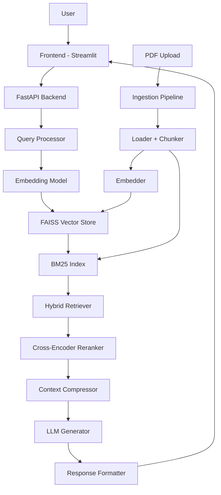

# ContexFlow — Project Review & Workflow Guide

## 🟢 Verdict: This is a Strong Project

Your architecture hits all the right notes for a production-grade RAG system. The modular design, hybrid retrieval, reranking, and source attribution are exactly what differentiates a serious project from a toy demo. You're on the right track.

---

## ✅ What's Already Great

| Aspect | Why It Works |
|---|---|
| **Modular folder structure** | Separation of ingestion, retrieval, generation — easy to test and extend |
| **Hybrid retrieval (FAISS + BM25)** | Catches both semantic and keyword matches — real-world pattern |
| **Reranking with cross-encoder** | Massive quality improvement for ~5 lines of code |
| **Source attribution** | Shows you understand explainability — recruiters notice this |
| **FastAPI + API-first design** | Makes the system deployable and testable independently from the UI |
| **Orchestrator pattern** | `rag_pipeline.py` as the central brain is clean architecture |

---

## 🔧 Suggested Improvements (Practical, Not Overkill)

### 1. Add a Caching Layer

> [!TIP]
> Cache repeated or similar queries to avoid redundant embedding + retrieval + LLM calls.

- Use a simple in-memory dict or Redis
- Hash the query → check cache → return if hit
- **Why:** Saves money (fewer LLM API calls), speeds up responses dramatically
- **Where:** Add `app/services/cache.py` or integrate into `rag_pipeline.py`
- **Difficulty:** Easy — 20 lines of code

---

### 2. Add Evaluation Metrics (This Will Impress)

> [!IMPORTANT]
> Without evaluation, you can't prove your system works well. Add at least basic metrics.

- **Retrieval quality:** Hit@K, MRR (Mean Reciprocal Rank)
- **Answer quality:** Use an LLM-as-judge approach (have the LLM score its own answers for faithfulness and relevance)
- **Where:** `scripts/evaluate.py` — you already have the file planned
- **Difficulty:** Medium — but extremely high-impact on your portfolio

---

### 3. Chunking Strategy Matters More Than You Think

> [!WARNING]
> Bad chunking = bad retrieval = bad answers. This is the #1 silent killer in RAG systems.

Your plan says 300–800 tokens with overlap. Good start, but consider:

- **Recursive character splitting** (LangChain's default) — works well for most docs
- **Semantic chunking** (split at paragraph/section boundaries) — better for structured docs
- **Chunk size experimentation** — try 256, 512, 1024 tokens and compare retrieval quality
- Store the chunk's **parent document ID + position** in metadata — essential for source attribution

---

### 4. Error Handling & Graceful Degradation

Add fallback behavior:
- If the vector DB returns no relevant results → tell the user "I don't have enough context" instead of hallucinating
- If the LLM API is down → return cached results or a clear error
- Set a **relevance score threshold** — don't pass garbage chunks to the LLM

---

### 5. Conversation History (Simple Version)

- Keep the last 3-5 turns in memory
- Prepend to the prompt as context
- This alone makes the system feel 10x more natural
- **Don't go overboard** — a simple list of `(query, answer)` tuples is enough

---

### 6. Streaming Responses

- FastAPI supports `StreamingResponse`
- If using OpenAI, use `stream=True`
- Makes the UI feel responsive even for long answers
- **Where:** `app/services/generator.py` + `app/api/routes.py`

---

## ⚠️ Things to Avoid

| Trap | Why | What To Do Instead |
|---|---|---|
| **Over-engineering early** | You'll spend weeks on infra and never finish | Get a working end-to-end pipeline first, then optimize |
| **Using LangChain for everything** | Hides what you actually built — interviewers will ask "what did YOU write?" | Use LangChain for loaders/splitters only, write the pipeline logic yourself |
| **Pinecone from day 1** | Adds complexity, API keys, costs | Start with FAISS locally, add Pinecone as an optional backend later |
| **React frontend too early** | Frontend will eat your time | Start with Streamlit, migrate to React only if you have time |
| **Skipping `.env` and config** | Hardcoded API keys = amateur hour | Use `pydantic-settings` for config from day 1 |

---

## 🗺️ Step-by-Step Workflow (Build Order)

### Phase 1: Foundation (Days 1–3)

```
Goal: Project structure + ingestion pipeline working end-to-end
```

- [ ] Create the folder structure (exactly as you planned)
- [ ] Set up `requirements.txt` with initial deps:
  - `fastapi`, `uvicorn`, `python-dotenv`, `pydantic-settings`
  - `sentence-transformers`, `faiss-cpu`
  - `PyPDF2` or `pymupdf` (for PDF loading)
  - `rank_bm25` (for BM25)
- [ ] Set up `.env` + `app/core/config.py` (load API keys, model names, chunk sizes)
- [ ] Build `app/ingestion/loader.py` — load PDFs and extract text
- [ ] Build `app/ingestion/chunking.py` — split text into chunks with overlap
- [ ] Build `app/ingestion/metadata_extractor.py` — extract filename, page number per chunk
- [ ] Build `app/models/embeddings.py` — wrapper around `sentence-transformers`
- [ ] Build `app/db/vector_store.py` — FAISS index: add, search, save/load
- [ ] Build `app/ingestion/embedding_pipeline.py` — ties loader → chunker → embedder → store
- [ ] Build `scripts/ingest_data.py` — CLI script to run the full ingestion
- [ ] **Test:** Drop a PDF in `data/raw/`, run ingestion, verify FAISS index is created in `data/embeddings/`

> [!TIP]
> **Milestone check:** You should be able to run `python scripts/ingest_data.py` and see chunks stored with metadata.

---

### Phase 2: Basic RAG Pipeline (Days 4–6)

```
Goal: Ask a question → get an answer with sources
```

- [ ] Build `app/services/retriever.py` — query FAISS, return top-K chunks with scores
- [ ] Build `app/services/generator.py` — send query + context to LLM, get answer
- [ ] Design your **system prompt** carefully:
  ```
  You are a helpful assistant. Answer the question using ONLY the provided context.
  If the context doesn't contain enough information, say so.
  Cite the source document and page number for each claim.
  ```
- [ ] Build `app/services/rag_pipeline.py` — orchestrator: retrieve → generate → format
- [ ] Build `app/models/schemas.py` — Pydantic models for request/response
- [ ] Build `app/api/routes.py` — `/query` and `/health` endpoints
- [ ] Build `app/main.py` — FastAPI app with router
- [ ] **Test with curl/Postman:**
  ```
  POST /query {"question": "What is traffic optimization?"}
  → Should return answer + sources
  ```

> [!TIP]
> **Milestone check:** You have a working API. Hit it with questions, verify answers come from the actual documents.

---

### Phase 3: Make It Smart (Days 7–10)

```
Goal: Hybrid retrieval + reranking + query processing
```

- [ ] Add BM25 to `app/services/retriever.py`:
  - Build a BM25 index alongside FAISS
  - Merge results (Reciprocal Rank Fusion works great for this)
- [ ] Build `app/services/reranker.py`:
  - Use `cross-encoder/ms-marco-MiniLM-L-6-v2` from HuggingFace
  - Re-score top-K results, re-sort
- [ ] Build `app/services/query_processor.py`:
  - Clean the query (lowercase, strip, etc.)
  - Optional: use LLM to rewrite vague queries
- [ ] Add relevance threshold — filter out low-score chunks before sending to LLM
- [ ] Add context compression — trim chunks to relevant sentences only
- [ ] Update `rag_pipeline.py` to wire everything together
- [ ] **Test:** Compare answer quality before/after reranking (you'll see a clear improvement)

> [!TIP]
> **Milestone check:** Ask the same question with and without reranking. The reranked version should be noticeably better.

---

### Phase 4: Frontend + Upload (Days 11–14)

```
Goal: Chat UI with document upload
```

- [ ] Build `frontend/app.py` with Streamlit:
  - Chat interface (use `st.chat_message`)
  - File upload widget → calls `/upload` endpoint
  - Display answer + expandable source cards
- [ ] Add `/upload` endpoint in `app/api/routes.py`:
  - Accept file upload
  - Trigger ingestion pipeline
  - Return success/failure
- [ ] Show source attribution in the UI:
  - Document name
  - Page number
  - Relevant snippet (highlighted if possible)
- [ ] Add conversation history (last 5 turns)
- [ ] Add a loading spinner / streaming indicator

> [!TIP]
> **Milestone check:** Upload a PDF through the UI, ask questions, see answers with sources.

---

### Phase 5: Polish & Deploy (Days 15–18)

```
Goal: Docker + evaluation + README
```

- [ ] Build `docker/Dockerfile` and `docker-compose.yml`
- [ ] Add logging throughout (`app/core/logging.py`)
- [ ] Build `scripts/evaluate.py` — test with sample Q&A pairs
- [ ] Write a proper `README.md`:
  - Architecture diagram
  - Setup instructions
  - API documentation
  - Screenshots of the UI
  - Performance metrics
- [ ] Add error handling everywhere
- [ ] Optional: Deploy to a free tier (Railway, Render, or HuggingFace Spaces)

---

## 📋 Key Technical Decisions to Make Early

| Decision | Recommendation | Reasoning |
|---|---|---|
| **LLM Provider** | Start with OpenAI (`gpt-3.5-turbo`) | Cheapest, fastest, most reliable. Switch to `gpt-4o-mini` if budget allows |
| **Embedding Model** | `all-MiniLM-L6-v2` | Fast, free, runs locally, good enough quality |
| **Vector DB** | FAISS (local) | Zero setup, no API keys, perfect for development |
| **Chunk Size** | Start with 512 tokens, 50-token overlap | Good default, tune later based on evaluation |
| **Reranker** | `cross-encoder/ms-marco-MiniLM-L-6-v2` | Small, fast, dramatic quality improvement |
| **Frontend** | Streamlit first | Ship fast, iterate, migrate to React only if needed |

---

## 🏗️ Architecture Diagram (Your System)



---

## 💡 Pro Tips From Experience

1. **Test retrieval BEFORE adding the LLM.** If your retriever returns garbage, no LLM can save you. Print the top-5 chunks for every query during development.

2. **Log everything.** Log the query, retrieved chunks, reranked order, and final prompt. When something goes wrong (and it will), logs are your lifeline.

3. **Start with 2-3 PDFs you know well.** Use documents where you already know the answers — makes debugging 10x easier.

4. **The prompt is 50% of the work.** Spend real time crafting your system prompt. A bad prompt with great retrieval still gives bad answers.

5. **Git commit at every milestone.** Each phase above = one commit minimum. Makes it easy to demo your progress in interviews.

---

## 📦 Minimal `requirements.txt` to Start

```
fastapi==0.115.0
uvicorn==0.30.0
python-dotenv==1.0.1
pydantic-settings==2.5.0

# Document Processing
PyMuPDF==1.24.0
python-docx==1.1.0

# Embeddings & ML
sentence-transformers==3.0.0
faiss-cpu==1.8.0
rank-bm25==0.2.2

# Reranking
transformers==4.44.0

# LLM
openai==1.45.0

# Frontend
streamlit==1.38.0
```

---

> [!IMPORTANT]
> **The single most important thing:** Get a working end-to-end pipeline (Phase 1 + 2) as fast as possible. A simple system that works is infinitely better than an advanced system that's half-built. You can always add reranking and hybrid retrieval later — but the core loop of "ingest → retrieve → generate" must work first.
